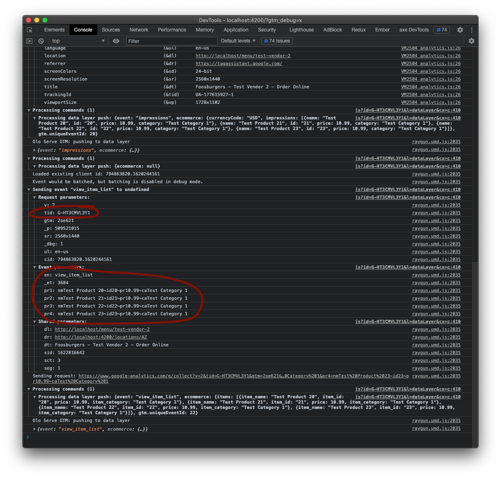

# Olo Serve GTM Template

## Table of Contents

* [Introduction](#introduction)
* [Changelog](#changelog)
* [Simple Setup](#simple-setup)
* [Manual Setup](#manual-setup)
* [Available Events](#available-events)
* [Migrating from Firebase](#migrating-from-firebase)

## Introduction

The easiest way to integrate Google Tag Manager (and Google Analytics) with Olo Serve is to use this template to automatically create custom GTM events for each "global event" emitted from Olo Serve. These custom events map to each of the [GA Enhanced Ecommerce](https://developers.google.com/tag-manager/enhanced-ecommerce) activities, and they can be used to pass data from Serve to GA.

[Read more about Olo Serve's global data and events here.](https://olosupport.zendesk.com/hc/en-us/article_attachments/360094400872/Olo_Serve_Global_Data_and_Events.pdf)

## Changelog

* June 10, 2021
  * Added GA4 support
  * Event name changes
    * `productsVisible` event became `impressions` to match UA standard
    * `viewProductDetail` event became `detail` to match UA standard
    * `clickProductLink` event became `productClick` to match UA standard

## Simple Setup

The fastest way to get started with Olo Serve and GTM is to [import a container configuration](https://support.google.com/tagmanager/answer/6106997?hl=en#import) from [our Github repository](https://github.com/ololabs/olo-serve-gtm-templates/container). This will install the Olo Serve GTM templates and add the appropriate triggers, variables, and tags to track interactions with Serve via Google Analytics. The configurations are ideal for new or existing GTM setups, and they support either GA4 or Universal Analytics. Additionally, they can be used to configure Serve Mobile analytics for iOS and Android.

If you are worried about importing a configuration conflicting with your existing GTM setup, follow one of the manual setup instructions below.

### 1. Import a container configuration

To import a container configuration, open your GTM container and navigate to the Admin tab.

Select one of the JSON configuration [downloaded from our Github repository](https://github.com/ololabs/olo-serve-gtm-templates/container) that best suits your needs. In most cases, this will be `olo-serve-container-configuration-ga4-web.json` as it leverages GA4 and only contains tracking for Serve web. If you are using Serve Mobile for apps, you downloading `olo-serve-container-configuration-ga4-all.json` would be a better choice.

You can choose which workspace to import the configuration to, and whether or not to merge or overwrite existing tags.

### 2. Configure Google Analytics

Google Analytics must be configured to receive data from GTM events. How you do this depends on whether or not you are using Universal Analytics (UA) or GA4 tracking.

#### 2a. Add Google Analytics 4 configuration

If you are using GA4, instead of editing a variable you need to update a tag. Edit the GA4 Configuration tag and set the Measurement ID. 

#### 2b. Update Universal Analytics tracking ID

Although UA is officially deprecated, many brands still use it to track their data. If you imported a UA configuration, you must configure the Serve Google Analytics Settings variable. Add your account's UA to the Tracking ID field.

### 3. Verify data is flowing to Google Analytics

Once you have configured Google Analytics, preview your new GTM setup and inspect network traffic or the output of the Google Analytics Debugger Chrome plugin. For each trackable action (see [Available Events](#available-events)) you should see corresponding data pushed to GTM and then GA.

#### 3a. Google Analytics 4

#### 3b. Universal Analytics

## Manual Setup

If using the pre-built container configuration is not desireable for any reason, you can still take advantage of this template by setting it up manually.

### 1. Import the Olo Serve template

To start using the Olo Serve GTM template, import it from the Community Template Gallery.

### 2. Configure the Olo Serve Template

The Olo Serve Template is a custom tag that listens for changes in Serve, and then emits `dataLayer` events that can be used as triggers in GTM.

You can configure the template to work with Google Analytics 4, Universal Analytics, or Legacy ga.js analytics.

You can find the installed Olo Serve tag under "Custom".

After adding the tag, select which events you'll want forwarded to Google Analytics. This tag should be triggered on all DOM Ready events.

#### 2a. Google Analytics 4

By selecting GA4, the `dataLayer` events will match the [GA4 Developer's Guide specifications](https://developers.google.com/tag-manager/ecommerce-ga4).

#### 2b. Universal Analytics

By selecting UA, the `dataLayer` events will match the [Enhanced Ecommerce Developer's Guide specifications](https://developers.google.com/tag-manager/enhanced-ecommerce).

#### 2c. Legacy ga.js Analytics

*Deprecated*

This only supports the transaction event and is only included for backwards compatibility.

### 3. Add platform variables (optional)

If you want to track Serve web and Serve Mobile events separately, you need to route data from GTM to more than one Google Analytics account. This is covered in more detail under [Add Tags](#5-add-tags), but a prerequisite is to add variables to differentiate between platform. These variables key off device information exposed by Serve.

### 4. Add triggers

Before you add tags for sending data to GA, you need to add triggers that will be fired when an event is pushed to the `dataLayer` from Serve. The names of the events to listen for depend on if you are using GA4 or UA. A full list of event names are available in the [GA4 Developer's Guide specifications](https://developers.google.com/tag-manager/ecommerce-ga4) or the [Enhanced Ecommerce Developer's Guide specifications](https://developers.google.com/tag-manager/enhanced-ecommerce).

#### 4a. Serve Mobile

If you are using Serve Mobile, you need to differentiate between data from the web and iOS/Android apps. To achieve this, you must define the conditions for when to fire a tag.

### 5. Add tags

Adding Google Analytics tags and wiring them to triggers is the final step in taking data from Serve and sending it to Google Analytics. How this is done differs slightly between GA4 and UA.

#### 5a. Google Analytics 4

You must define the event parameters as defined in the [GA4 Developer's Guide specifications](https://developers.google.com/tag-manager/ecommerce-ga4). Add a new variable to map from the `dataLayer` to what GA4 is expecting.

For the full list of tag configurations, see each "Tag configuration for this example" section in the [GA4 Developer's Guide specifications](https://developers.google.com/tag-manager/ecommerce-ga4).

#### 5b. Universal Analytics

You must define the event parameters as defined in the [Enhanced Ecommerce Developer's Guide specifications](https://developers.google.com/tag-manager/enhanced-ecommerce).

For the full list of tag configurations, see each "Tag configuration for this example" section in the [Enhanced Ecommerce Developer's Guide specifications](https://developers.google.com/tag-manager/enhanced-ecommerce).

## Available Events

Event Name | Description
--- | ---
addToCart | [A product is added to the cart.](https://developers.google.com/tag-manager/enhanced-ecommerce#add)
removeFromCart | [A product is removed from the cart.](https://developers.google.com/tag-manager/enhanced-ecommerce#cart)
checkout | [A user proceeds to the Checkout page.](https://developers.google.com/tag-manager/enhanced-ecommerce#checkout)
purchase | [A user has completed their purchase.](https://developers.google.com/tag-manager/enhanced-ecommerce#purchases)
productClick | [A user clicks a product link.](https://developers.google.com/tag-manager/enhanced-ecommerce#product-clicks)
detail | [A user views the details and/or configures a product.](https://developers.google.com/tag-manager/enhanced-ecommerce#details)
impressions | [A product becomes visible on the screen.](https://developers.google.com/tag-manager/enhanced-ecommerce#product-impressions)

## Migrating from Firebase

Serve Mobile no longer supports Firebase. Here is a list of events previously tracked in Firebase and how to implement them in GTM.

Firebase Event | GTM Implementation
--- | ---
add_to_cart | Serve's `addToCart` event
app_clear_data | _Not Supported_
app_remove | _Not Supported_
app_update | _Not Supported_
BasketCreationError | _Not Supported_
CardScan | _Not Supported_
CreateBasket | _Not Supported_
ecommerce_purchase | Serve's `purchase` event
Favorite | Listen for clicks to the favorite button with GTM
Feedback | Listen for clicks to the feedback button with GTM
first_open | _Not Supported_
Location | _Not Supported_
LoginView | Listen for pageview changes with GTM
MainMenu | Listen for clicks to the menu button with GTM
os_update | _Not Supported_
screen_view | Listen for pageview changes with GTM
session_start | _Not Supported_
User | _Not Supported_

## Adding Serve Mobile Tracking

If you use these templates for integrating tracking into Serve web today, the simplest path to adding support for Serve Mobile is to remove all existing tags, triggers and templates related to older versions of these instructions and import one of the container configurations above.

If that is not an option, the best place to start is [adding platform variables](#3-add-platform-variables-optional), filtering existing tags to only apply to Serve web, and then adding additional triggers and tags for each Serve Mobile platform.
